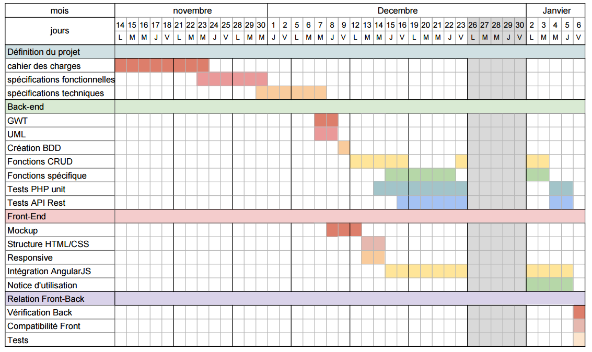

<link rel="stylesheet" type="text/css" href="styles.css" />
# Cahier des charges pour une application mobile : «InterFACE »
  
### Sommaire
###### PRÉSENTATION GÉNÉRALE DU PROJET
###### LES EXIGENCES FONCTIONNELLES
###### PRÉCONISATIONS GÉNÉRALES
###### DÉROULEMENT DU PROJET
###### MODALITÉS

##### 1. PRÉSENTATION GÉNÉRALE DU PROJET

  1. Présentation

      Face est une association composée environs de quatre employés. Elle à pour objectif principale de lutter contre l’exclusion dans le domaine pro. Pour faire face à ce problème, elle propose des services qui lui permettent d’accompagner ces flux, jusqu’à ce qu’ils aient une stabilité professionnelle.
      Pour palier à un manque qui concerne la gestion des données information collecté lors des entretiens avec le flux. Pour cela, elle s’attend à ce que nous lui proposions une  application web, qui lui permettra tout d’abord de pouvoir stocker les données relatives au flux et offres enregistrées, mais aussi de pouvoir y faire une recherche optimale, qui permettrait à chaque employé d’apporté une réponse rapide et efficace au flux lors des entretiens.
      Cette application doit permettre la réalisation d’autres tâches tel que, la gestion et la planification des entrevues. Mais aussi, permettre aux ‘Super User’ de bénéficier d’ une vue globale sur le fonctionnement de l’association et donner lieux notamment à la gestion des comptes employés.A travers cette application l’employé pourra accompagner de manière optimale chaque flux, jusqu’à la stabilisation de son de sa situation professionnelle.

      ###### Qui est la Code Academie?

      La Code académie, initiée par le réseau d’entreprises Face (Fondation agir contre l’exclusion) et l’organisme de formation Simplon.co, ouvrira ses portes à Rennes dès le mois de mai 2016.

      Labellisée GEN pour Grande école du numérique, la Code académie fait partie des six formations ayant obtenu cette mention à Rennes, sur les 171 du territoire national. Elle formera pendant 8 mois 24 adultes au métier de développeur web, spécialisé en langage PHP.

      Cette formation propose un apprentissage répartie entre 840 heures dédiées aux langages informatiques (HTML, CSS, JS, PHP) et aux outils techniques (Symphony, Angular...), ainsi que 280 heures à l'insertion professionnelle.

  * __Brief__
    1. Description de l’application

      __Cibles__

      ###### Qui est la cible ?
      FACE Rennes (Fondation Agir Contre l'Exclusion) est une association spécialisée dans l'insertion professionnelle. Elle fait partie d'un réseau plus dense d'associations présentes sur tout le territoire.

      #### Détail sur l'entreprise ?
      
Cette association à une 4 employées à son actif, qui s'occupe chaqu'un d'une dizaine de flux par ans.

      Sont désigné entant que flux les personnes mise en marge du monde du travail.
      Ces personne represente une bonne partie des missions pour chaque employé de la fondation.

      #### Membre de l'équipe FACE:
        + Sfia AGOUJIL
        + Daïna RIVERAIN
        + Mustapha LAABID
        + Christine KERVENNIC
        + Malika AIT HAMMAD

    * __Besoin et contexte.__
      ##### Besoin exprimé par la cible:
      1. D'un agenda personnel et un autre plus global.
      * Un système de mailing automatisé à la création d'un rendez-vous.
      * Une messagerie interne pour demander l'autorisation à ses collègues.
      * D'une fonction de recherche par nom du flux.
      * Une interface qui comprend :
      * Un historique lié à ce flux (rendez-vous, fichiers, actions menées).
      * Une possibilité de consulter les fichiers liées à ce flux et d'en associer de nouveaux
      * Une photo du flux
      * Un résumé de sa situation (status, cours brief).
      * D'une interface récapitulative des employés avec une présentation très visuelle des éléments cités plus haut.
      * La possibilité de mettre des notes personnelles sur ses employés pour préparer la réunion d'équipe.
      * La possibilité d'accéder à une interface plus détaillée des actions menées par l'employé.
      * Le trie des profils se fera par les attributs suivant:
        * "genre"
        * "nom"

      * Le trie des offres d'emploi se fera par les attributs suivant:
        * "metier"

    * __Fonctionnalités principales.__

      Cette application doit permettre au employés lors de entrevue avec le flux, un stockage organisé des données et fichiers, ainsi qu'une recherche optimale à travers la base de données.

#### 2. LES EXIGENCES FONCTIONNELLES

- Application destinée principalement aux employés de Face.
- Une fonction de recherche efficace et rapide qui permet de retrouver une page descriptive sur toutes les actions menées pour le flux et le suivi.
- Un suivis des flux après l’insertion pro (3 - 6 - 9 mois).
- Un agenda centralisé pour les employés de FACE(de façon que chacun connaisse les disponibilités de l'autres pour lui assigner un flux)
- Un suivi des actions menées par l'employé sur une période donnée
- Un système de mailing intégré avec envoi automatique aux dates de suivi.
- Un système de messagerie interne.
- Un système de reminder (notifications) pour les différents rendez-vous.
- Un système de gestion des fichiers et des offres d'emplois.
- Prévoir un usage à grande échelle (Face France 64 utilisateur).
- Compte supérieur (corps de direction) avec des privilèges supplémentaire et une possibilité d’avoir une vision globale des flux.
- Doit être supportable par tout type de visionneur.

#### 3. PRÉCONISATIONS GÉNÉRALES
3.1 Charte graphique et navigation.

  Face detient une charte grapique étant propre à sa fondation. Elle devra nous la fournir à fin de pouvoir élaborer la maquette de l'application côté front.

3.1.1 Ergonomie de l’interface.

  L'interface devra êre conçu selon l'expérience de l'utilisateur, à fin de pouvoir lui permettre de gagner en rapidité lors des entrevues. Mais aussi, rendre les fonctionnalités accessible durant la navigation. Cela permettrait dans un premier temps de réduire le nombre de clic pour avoir accès à une fonctionnalité. Dans un second,réduira la navigation de l'oeil sur l'écran,réduire le temps de parcours dans l'optique de réduire la fatigue.

3.1.2 Gamme de couleur

  voir charte graphique de Face.

3.1.3 Typographie

  voir charte graphique de Face.

3.1.4 Mise en page
  Cette application devoir l'aspect d'un Dashbord, reprenant toute les fonctionnalité

3.2 Développement

  Point de vue développement, cette application se verra développer d'une part avec PHP7 côté back office( pour la gestion et le stockage des données ). D'autre part en Angulars Js coté front office pour l'affichage des données.

  ###### Supportable sur différent type de média?
  L'application sera supportable par des écrans compris en tre 360px460px jusqu'à 1920x900px.

  + Technologie utilisé pour l'élaboration de ce projet.
    - Nginx
    - Mysql
    - PHP 7
    - Symfony 3
    - Angulars
    - Html 5
    - Css3

3.3 Matériel

  L'application interface sera propulser depuis un server local en Intranet. Le système Intranet ne necessite pas de connecion internet. Ce qui réduit les coût à une connexion internet et ne permet de prendre en charge que le coût du matériel informatique.

3.4 Téléchargement et installation du logiciel.
  ###### Document d’installation et d’usage de l’application.

  Ces documents contiendrons toutes les marches à suivre, pour que l'usager puisse être autonome dans le déploiement de l'application et lors de son usage.

#### 4. DÉROULEMENT DU PROJET

4.1 Phases du projets
  4.1.1 Conception
  4.1.2 Réalisation
  4.1.3 Recette
  4.1.4 Déploiement

4.2 Ressources humaines
  L'équipe qui travaillera sur ce projet est constitué de:
  * Développeur Front
  Compétence: Tous les développeur Font de la code Academie pour ce projet InterFace sont formé à Angular Js 1.5, Html5/Css3, Sass.
   équipe:
    * Floryan LOLLIVIER
    * Patrice GUERNON
    * Nabil MASKALI
    * Ronald MARCEL

  * Développeur back
  Compétence: Tous les développeur Back de la code Academie pour ce projet InterFace sont formé à Symfony, PHP7.
    * Solenne Hault
    * Valentin SUSSET
    * Rebecca Maccio
  * Référent numérique
    * Miguel Katshiete

4.3. Planification

  

##### 5. Contrainte techniques
* Réseau intranet
* Format Média
+ Au vu, du parc informatique présent chez FACE et après analyse des résolutions supportées, nous ne pourrons proposer un affichage allant de:
- de 960px à 1200px. Au delà de ces dimensions, il ne sera pas supportable.

* Sécurité du réseaux
+ Le réseau de FACE étant limité à une connexion en filaire, pour des raison de sécurité ne proposera pas de connexion san fil.
* Délai
+ temps de travail 6 à 7 semaines.

#### 6. MODALITÉS

5.1 Réception des résultats des prestations

5.2.Livrables
Une première version avec les fonctionnalités principales telqueles gestion et le tri des profils.
  L'application que Face nous a demander de concevoir sera livrable à partir:

    Date: 8 janvier 2017.

  L'application sera executable depuis un serveur en intranet.

5.3.2 Prèstation service àprès vente.

  L'association est pleinnement consciente que la code académie, ne sera en mesure de lui proposer un services après ventes après livraison de l'application. Toutefois, il lui sera fournie en annexe:

  + Documentation fournie
   - Une notice d'installation
   - Une spécification fonctionnelle
   - Une spécification technique
   - Un guide d'administration

5.3.3 Au niveau ergonomique

#### 6. Specification fonctionnelle
